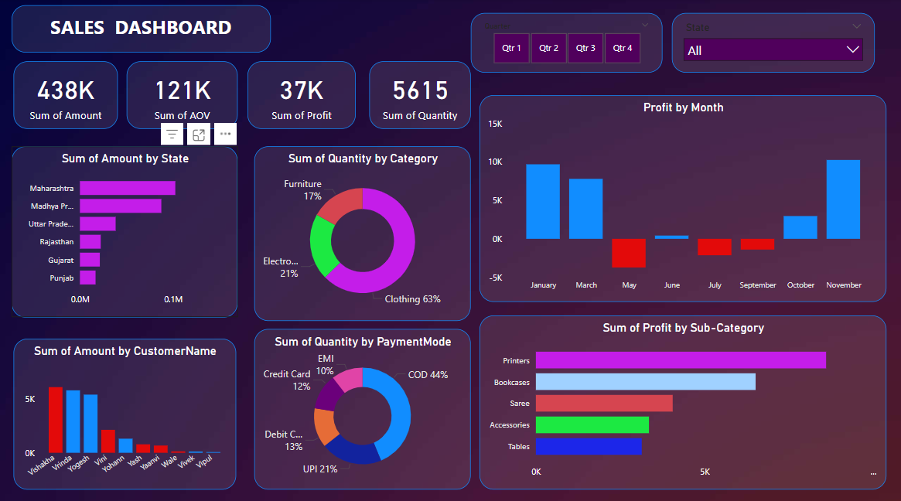

# 📊 Sales Dashboard using Power BI  

  

## 📌 Overview  
This project is a **Sales Analysis Dashboard** built using **Power BI**.  
It provides a comprehensive visualization of sales performance, profit trends, and customer behavior using interactive charts and graphs.  

## 🚀 Features  
🔹 **Sum of Amount by State** 🌍  
🔹 **Sum of Quantity by Category** 🛍️  
🔹 **Profit by Month** 📈  
🔹 **Sum of Profit by Sub-Category** 📊  
🔹 **Sum of Amount by Customer Name** 🏷️  
🔹 **Sum of Quantity by Payment Mode** 💳  

## 🛠️ Tech Stack  
- **Data Visualization Tool:** Power BI  
- **Data Source:** Excel / SQL / CSV  
- **Metrics Used:** Total Sales, Profit, Quantity, AOV (Average Order Value)  

## 📸 Dashboard Insights  
- **State-wise Sales Distribution** to analyze top-performing states.  
- **Category-wise Quantity Breakdown** to understand which products are sold the most.  
- **Monthly Profit Trends** with positive (blue) and negative (red) indicators.  
- **Sub-category Profit Analysis** to track the most profitable products.  
- **Customer-wise Sales Distribution** to identify key buyers.  
- **Payment Mode Distribution** to determine popular payment preferences.  

## 📌 How to Use?  
1️⃣ Download and open the **.pbix file** in Power BI  
2️⃣ Connect your dataset (if required)  
3️⃣ Explore the interactive dashboard  
4️⃣ Filter data by **Quarter, State, Customer Name, or Payment Mode**  

## 📜 License  
This project is licensed under the **MIT License**.  

## 🔗 Connect With Me  
📧 Email: vaibhavchauhan.contactme@gmail.com  
🔗 LinkedIn:(https://www.linkedin.com/in/vaibhavchauhan15/) 

---

⭐ **If you like this project, don't forget to give it a star!** ⭐  
